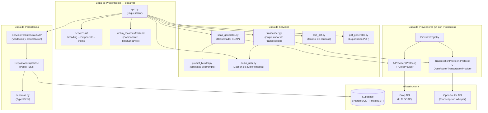

# ⚡ FAST SOAP IA — Asistente de Evoluciones Clínicas

<div align="center">


**Prototipo académico v1.0 · Universidad Autónoma de Occidente**

</div>

---

## 📝 Descripción del Proyecto

### Propósito

FAST SOAP IA es un asistente clínico basado en inteligencia artificial que ayuda al personal de salud en **Unidades de Cuidado Intensivo (UCI)** y **hospitalización** a redactar **notas SOAP** (*Subjetivo, Objetivo, Evaluación, Plan*) de forma automatizada. El sistema transcribe audio clínico, genera evoluciones estructuradas, compara cambios entre versiones y persiste el historial, reduciendo el tiempo de documentación y mejorando la calidad de los registros clínicos.

### Alcance

| Lo que hace | Lo que no hace |
|---|---|
| Generación de notas SOAP por IA (proveedor Groq) | Sistema de Historias Clínicas Electrónicas (HCE) completo |
| Transcripción de audio clínico (OpenRouter Whisper) | Diagnóstico médico automatizado |
| Control de cambios visual (diff) entre evoluciones | Interoperabilidad con plataformas HCE externas |
| Persistencia y consulta de historial en Supabase | Cumplimiento de normativas sanitarias (responsabilidad del operador) |
| Exportación a PDF con reporte de validación | Reemplazo del juicio clínico del profesional |

### Público Objetivo

- **Médicos intensivistas** y **enfermeros** que documentan evoluciones diarias en UCI.
- **Personal clínico** en hospitalización que requiere redacción estructurada de notas SOAP.
- **Equipos de gestión** que buscan estandarizar la calidad de la documentación clínica.
- **Estudiantes y académicos** de ciencias de la salud en entornos formativos.

---

## 🗺️ Arquitectura de la Solución e Interoperabilidad

### Diagrama de Componentes



### Desacoplamiento y Patrones de Diseño

El proyecto sigue una arquitectura limpia basada en **inyección de dependencias** y **programación orientada a protocolos**:

| Patrón | Aplicación | Ubicación |
|---|---|---|
| **Protocol / Duck Typing** | Contratos `AiProvider`, `TranscriptionProvider`, `RepositorioEvoluciones` | `services/providers/base.py`, `services/persistence/interfaces.py` |
| **Repository** | Abstracción de base de datos (Supabase) detrás de un protocolo | `services/persistence/repository.py` → `interfaces.py` |
| **Registry** | Resolución dinámica de proveedores según variable de entorno `SOAP_PROVIDER` | `services/providers/registry.py` |
| **Strategy** | Implementaciones intercambiables de proveedores AI y transcripción | `GroqProvider`, `OpenRouterTranscriptionProvider` |
| **Service Layer** | Orquestación con validación de negocio separada del acceso a datos | `services/persistence/service.py` |
| **Dependency Injection** | Los consumidores reciben sus dependencias por constructor | `SoapGenerator(provider)`, `ServicioPersistenciaSOAP(repositorio)` |

### Modelos de Datos

El modelo principal es `EvolucionSOAP` (TypedDict en `services/persistence/schemas.py`):

```python
class EvolucionSOAP(TypedDict):
    id: int                    # Autoincremental
    patient_id: str            # Identificador único del paciente (ej. PAC-001)
    evolucion_anterior: str    # Texto de la evolución previa
    nueva_evo: str             # Nota SOAP generada
    justificacion: str         # Justificación clínica de los cambios
    usuario: str               # Operador que generó la evolución
    created_at: str            # Timestamp ISO 8601
```

**Tabla en Supabase:** `evoluciones_soap` — consultable por `patient_id` con paginación por cursor.

---

## 🛠️ Tecnologías y Requisitos Previos

### Stack Tecnológico

| Capa | Tecnología | Versión |
|---|---|---|
| **Lenguaje** | Python | ≥ 3.12 |
| **Web Framework** | [Streamlit](https://streamlit.io) | ≥ 1.58.0 |
| **LLM (SOAP)** | [Groq SDK](https://console.groq.com) | ≥ 1.4.0 |
| **Transcripción** | OpenRouter API (HTTP) | — |
| **OpenAI SDK** | openai | ≥ 2.38.0 |
| **Base de Datos** | [Supabase](https://supabase.com) (PostgreSQL + PostgREST) | ≥ 2.0.0 |
| **PDF** | fpdf2 | ≥ 2.8.7 |
| **Audio** | ffmpeg / ffprobe | sistema |
| **Frontend (audio)** | TypeScript + Vite | TS 5.5 / Vite 5.4 |
| **Paquetería** | [uv](https://docs.astral.sh/uv) | — |
| **Linting** | Ruff | ≥ 0.6 |
| **Type Checking** | mypy | ≥ 1.11 |
| **Testing** | pytest + pytest-cov | ≥ 8 / ≥ 5 |
| **Contenedor** | Docker | python:3.12-slim-bookworm |

### Dependencias de Entorno

- **ffmpeg + ffprobe** — necesario para procesamiento y chunking de audio.
- **Node.js ≥ 18 + npm** — solo si se compila el frontend del grabador de audio localmente (el contenedor Docker lo hace automáticamente).

---

## 📦 Guía de Instalación y Despliegue Local

### Estructura de Ramas

| Rama | Propósito |
|---|---|
| `main` | Rama estable, lista para producción |
| `feat/*` | Ramas de funcionalidad (`feat/XXX-descripcion`) |
| `fix/*` | Ramas de corrección |

### Paso 1: Clonar el Repositorio

```bash
git clone <url-del-repositorio>
cd UAO-Asistente-SOAP
```

### Paso 2: Configurar Variables de Entorno

Copie la plantilla y complete sus credenciales:

```bash
cp .env.example .env
```

| Variable | Descripción | Requerida |
|---|---|---|
| `OPENROUTER_API_KEY` | API key de OpenRouter para transcripción | Sí |
| `OPENROUTER_MODEL` | Modelo de Whisper (`openai/whisper-large-v3-turbo`) | Sí |
| `API_SECRET_KEY` | API key de Groq para generación SOAP | Sí |
| `SOAP_MODEL` | Modelo Groq a usar (`llama-3.3-70b-versatile`) | Sí |
| `SUPABASE_URL` | URL del proyecto Supabase | Sí |
| `SUPABASE_SERVICE_KEY` | Service-role key de Supabase | Sí |

> **⚠️ Seguridad:** Nunca comente `.env` en el control de versiones. El archivo `.gitignore` ya lo excluye.

### Flujo A: Despliegue con Docker (Recomendado)

```bash
# Construir la imagen
docker build -t uao-asistente-soap:local .

# Ejecutar el contenedor
docker run -d --restart unless-stopped \
  -p 8501:8501 \
  --env-file .env \
  --name uao-asistente-soap \
  uao-asistente-soap:local
```

La aplicación estará disponible en **http://localhost:8501**.

### Flujo B: Desarrollo Local

```bash
# Crear y activar entorno virtual
python -m venv .venv
.venv\Scripts\activate  # Windows
source .venv/bin/activate  # Linux/Mac

# Instalar dependencias (incluyendo dev)
uv sync --extra dev

# Construir frontend del grabador (opcional, primera vez)
make docker-frontend-build

# Ejecutar la aplicación
uv run streamlit run app.py
```

---

## ⚙️ Automatización y Gobierno del Código (Makefile)

El proyecto centraliza todas las operaciones en un `Makefile` para garantizar reproducibilidad.

### Comandos de Ciclo de Vida

| Comando | Descripción |
|---|---|
| `make install` | Instala dependencias con `uv sync --extra dev` |
| `make run` | Inicia Streamlit local (previa verificación de ffmpeg) |
| `make clean` | Limpia cachés y archivos compilados |

### Validación Estática

| Comando | Descripción | Herramienta |
|---|---|---|
| `make lint` | Verifica estilo y reglas de calidad | Ruff |
| `make format` | Formatea el código automáticamente | Ruff |
| `make typecheck` | Verifica tipos estáticos | mypy (strict) |
| `make check` | Ejecuta lint → typecheck → test secuencialmente | — |

### Pruebas

```bash
make test
```

Equivalente a: `uv run pytest tests/ -v --cov=services --cov=app --cov-report=term-missing`

Se requiere cobertura mínima del 80% en servicios y app.

### Comandos Docker

| Comando | Descripción |
|---|---|
| `make docker-build` | Construye la imagen Docker |
| `make docker-run` | Ejecuta contenedor con `.env` |
| `make docker-stop` | Detiene el contenedor |
| `make docker-rm` | Elimina el contenedor |
| `make docker-logs` | Sigue los logs del contenedor |
| `make docker-rebuild` | Stop + rm + build + run |

---

## 📖 Manual de Operación y Casos de Uso

### Módulo 0 — Selección de Historial Clínico

1. Ingrese el **ID del paciente** (ej. `PAC-001`) en el campo de búsqueda.
2. El sistema consulta Supabase y muestra las evoluciones anteriores del paciente.
3. Seleccione una evolución para usarla como base. El texto se carga automáticamente en el formulario.

### Módulo 1 — Ingreso de Evolución Anterior

- **Texto:** Pegue o escriba la evolución clínica del turno anterior.
- **Audio:** Use el botón de grabación para dictar. Al detener, el audio se envía a OpenRouter Whisper y se transcribe automáticamente al campo de texto.

### Módulo 2 — Ingreso de Cambios del Turno

- Describa los cambios ocurridos durante el turno actual.
- Soporta entrada por **texto** o **grabación de audio** con transcripción automática.

### Generación de Nota SOAP

1. Presione **"Generar Nota SOAP"**.
2. El sistema envía la evolución anterior + cambios al proveedor Groq.
3. El LLM estructura la respuesta siguiendo el formato SOAP: *Subjetivo, Objetivo, Evaluación, Plan*.
4. Se aplican 5 reglas de auditoría clínica (sin alucinaciones, español médico colombiano, códigos CIE-10, etc.).

### Vista de Resultados

| Pestaña | Descripción |
|---|---|
| **Nueva Evolución** | Nota SOAP generada con formato estructurado |
| **Control de Cambios** | Diff visual: texto **rojo tachado** = eliminado, texto **verde** = agregado |
| **Comparación por Líneas** | Diff estilo git: líneas con `-` (rojo) y `+` (verde) |
| **Justificación Clínica** | Explicación detallada de los cambios realizados |

### Exportación y Persistencia

- **Exportar PDF:** Descarga un reporte de validación clínica con la evolución anterior, cambios, nueva nota y justificación.
- **Guardar en Historial:** Una ventana de confirmación recuerda que el contenido es generado por IA y debe validarse clínicamente antes de guardar. Al confirmar, se persiste en Supabase.

### Indicadores de Estado

El sistema muestra badges de estado en cada operación:

| Estado | Significado |
|---|---|
| `idle` | Esperando entrada del usuario |
| `recording` | Grabación de audio en curso |
| `transcribing` | Procesando transcripción de audio |
| `generating` | Generando nota SOAP con IA |
| `done` | Operación completada exitosamente |
| `error` | Error en la operación (con detalle) |

---

### Estilo de Código

| Regla | Estándar |
|---|---|
| **Linter** | Ruff (select: E, F, I, N, W, UP, B, SIM, ARG, PL, D) |
| **Formato** | Ruff (comillas dobles, línea máxima 120) |
| **Tipado** | mypy strict mode — toda función debe tener anotaciones de tipo |
| **Pruebas** | pytest con cobertura ≥ 80% en módulos nuevos |
| **Commits** | Convención semántica: `feat:`, `fix:`, `refactor:`, `test:`, `docs:`, `chore:` |
| **Ramas** | `feat/XXX-descripcion`, `fix/XXX-descripcion` |

---

## 📄 Licencia y Reutilización

Este proyecto se distribuye bajo la **Licencia MIT**.

```
MIT License

Copyright (c) 2026 Equipo UAO — Proyecto Asistente SOAP

Permission is hereby granted, free of charge, to any person obtaining a copy
of this software and associated documentation files (the "Software"), to deal
in the Software without restriction, including without limitation the rights
to use, copy, modify, merge, publish, distribute, sublicense, and/or sell
copies of the Software, and to permit persons to whom the Software is
furnished to do so, subject to the following conditions:

The above copyright notice and this permission notice shall be included in all
copies or substantial portions of the Software.
```

**Términos:** Uso libre, modificación y distribución del software, siempre que se mantenga el aviso de copyright. El software se proporciona "tal cual", sin garantía de ningún tipo.

---

<div align="center">

**⚡ FAST SOAP IA · Asistente de Evoluciones Clínicas**  
*Prototipo académico — Universidad Autónoma de Occidente*  

*Integrantes:*
<p align="center">
  <b>Jhonattan Garcia</b><br>
  <b>Jean Marco Varon</b><br>
  <b>Francisco Quintero</b><br>
  <b>Andrea Mallama</b><br>
  <b>Heidy Romero</b>
</p>

</div>
